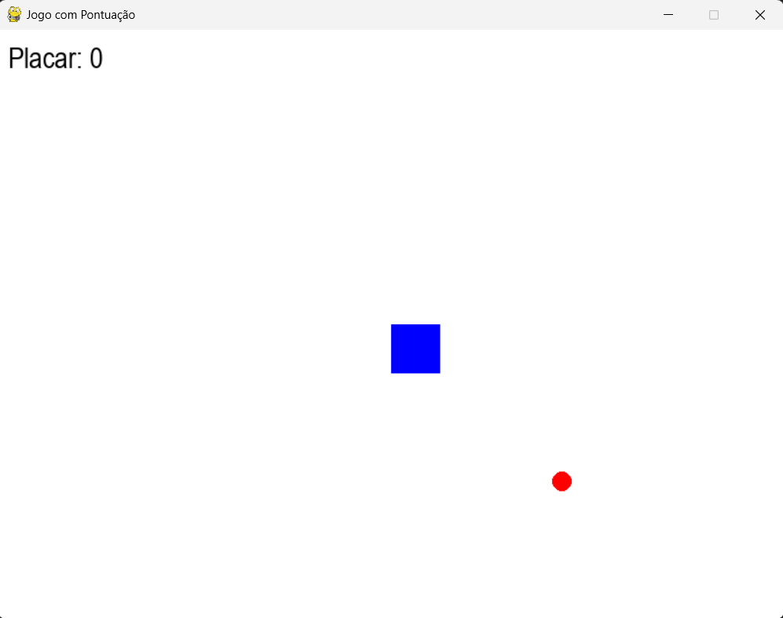

# 🎮 Jogos Educativos com PyGame - Projeto Flona Palmares

Este repositório contém dois jogos simples desenvolvidos com **Python e PyGame**, criados como parte das atividades do projeto social **Flona Palmares** — uma iniciativa sem fins lucrativos que oferece aulas de **informática básica e programação** para crianças e adolescentes da zona rural do município de Altos-PI.

Os jogos foram utilizados como recurso didático nas aulas de **lógica de programação, controle de fluxo, manipulação de eventos e sprites**, permitindo que os alunos aprendessem enquanto se divertiam.

---

## 🕹️ Jogos Desenvolvidos

### 1. 🟠 Jogo "Pega Bolinha"

Um jogo simples e divertido no qual o jogador move um personagem pela tela com o objetivo de **coletar bolinhas** que aparecem em posições aleatórias. Cada bolinha coletada **aumenta a pontuação** e faz surgir uma nova bolinha.

- Ideal para ensinar movimentação com teclado, colisão entre objetos e lógica de pontuação.
- Permite melhorias como controle de tempo e níveis de dificuldade.

📸 **Imagem do jogo em execução:**

---

### 2. ⚔️ Jogo "Viking vs Dragão"

Neste jogo, o jogador controla um **pequeno guerreiro viking** em uma batalha contra um **dragãozinho animado**. O objetivo é derrotar o inimigo desferindo golpes no tempo certo e desviando dos ataques.

- Ensina conceitos de animação de sprites, controle de ações simultâneas e mecânicas de ataque/defesa.
- Ótimo para explorar lógica de estados e eventos.

🎥 **Vídeo demonstrativo do jogo:**

---

## 👨‍🏫 Sobre o Projeto Flona Palmares

O **Flona Palmares** é um projeto social que visa democratizar o acesso à tecnologia e ao conhecimento digital para crianças e adolescentes da zona rural. As aulas incluem:

- Alfabetização digital
- Microsoft Office (Word, Excel, PowerPoint)
- Programação em **Python com jogos**
- Criação de interfaces interativas

Esses jogos foram frutos do aprendizado dos alunos e demonstram o potencial transformador da tecnologia aplicada à educação.

---

## 🛠️ Tecnologias Utilizadas

- **Python 3**
- **PyGame**